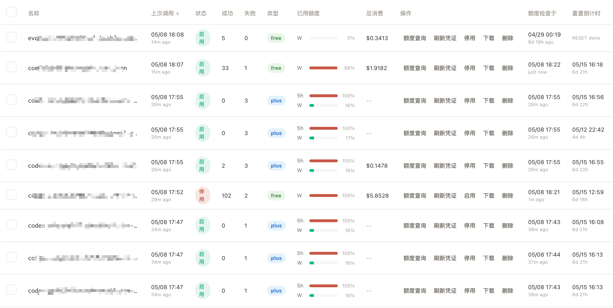

# CPAplus

English | [中文](README_CN.md) | [日本語](README_JA.md)



A proxy server that provides OpenAI/Gemini/Claude/Codex compatible API interfaces for CLI.

Modified from:
- [CLIProxyAPI](https://github.com/router-for-me/CLIProxyAPI) — the core proxy server
- [Cli-Proxy-API-Management-Center](https://github.com/router-for-me/Cli-Proxy-API-Management-Center) — the management web UI

## What's Changed

### 1. Usage Statistics Restoration with SQLite Persistence

**Pain point**: The upstream project removed usage statistics tracking. Users had no visibility into request volumes, token consumption, latency, or error rates across their API keys and models.

**Changes**:
- Restored `LoggerPlugin` + `RequestStatistics` in `internal/usage/`, registered into the SDK usage distribution pipeline
- Added `SQLitePlugin` that persists every request record to a SQLite database (`usage.db`)
- On startup, `LoadAll()` rebuilds in-memory statistics from historical SQLite records, so stats survive restarts
- Added management API endpoints:
  - `GET /v0/management/usage-statistics` — returns statistics snapshot (backward-compatible format)
  - `GET /v0/management/usage-statistics/export` — export full snapshot
  - `PUT /v0/management/usage-statistics/import` — merge import with deduplication
- Added `usage-db-path` config option (defaults to `usage.db` next to config file)
- Frontend: Usage Statistics page with overview cards, RPM/TPM charts, hourly/daily bar charts, API breakdown, token breakdown, and latency stats

### 2. Auth Index Prefix Differentiation

**Pain point**: When multiple OpenAI compatibility entries shared the same API key but used different `name` + `prefix` combinations (e.g., same upstream key routed under different prefixes for different model groups), they produced identical `auth_index` values. This caused the management UI to display all requests under a single provider name, making it impossible to distinguish which prefix/model group a request belonged to.

**Changes**:
- Added `prefix` to the `Attributes` map in the config synthesizer for all 5 providers (OpenAI compat, Gemini, Claude, Codex, Vertex)
- Updated `indexSeed()` in `sdk/cliproxy/auth/types.go` to include `prefix` in the hash computation, so `auth_index = SHA256(name + prefix + apiKey + ...)` instead of `SHA256(name + apiKey + ...)`
- Frontend `resolveSourceDisplay` now resolves source display via `auth_index` as the primary lookup key (instead of raw source/API key), ensuring each provider entry maps to its correct display name
- Frontend fetches OpenAI compatibility data from the dedicated `/openai-compatibility` API (which includes `auth-index`) instead of `/config` (which does not)
- SQLite usage store now has schema versioning — when schema version mismatches, tables are automatically rebuilt

### 3. Codex Quota Management & Credential Control

**Pain point**: The original project made it inconvenient to centrally check Codex account quota usage.

**Changes**:
- Added `internal/codex/quota.go` — OAuth token refresh (reusing `internal/auth/codex` package), quota querying via OpenAI usage API, auto-disable/enable logic, quota data persistence to auth files
- Added management API endpoints:
  - `POST /v0/management/auth-files/quota-check` — batch quota check + token refresh + auto-disable/enable
  - `POST /v0/management/auth-files/refresh-token` — batch token refresh
- Quota fields written to auth JSON files: `quota_plan_type`, `quota_windows` (with usedPercent, resetAtIso), `quota_checked_at`, `quota_error`
- Auto-disable: when quota reaches 100%, the auth file is disabled automatically; re-enabled when quota resets
- Frontend: Quota display per auth file card with plan type badge, usage bars, and reset countdown
- Auth file list now reads quota fields from disk on page load (no manual check required for display)

### 4. Model Pricing & Cost Tracking

**Pain point**: There was no way to track how much each API call costs. Users had to manually look up model prices and calculate expenses themselves.

**Changes**:
- Added `internal/pricing/` package — syncs model prices from [LiteLLM](https://github.com/BerriAI/litellm) on startup and every 72 hours (pricing approach referenced from [agent-usage](https://github.com/briqt/agent-usage))
- Custom prices (e.g., MiMo models) are managed via API and never overwritten by LiteLLM sync
- Fuzzy model name matching (prefix stripping, substring containment) for price lookup
- `usage_records` table now includes `cost_usd` column — calculated at insertion time using input/output/cache token prices
- `CalcCost()` handles cached tokens separately (cache read price vs. input price)
- Imported legacy data (without `cost_usd`) is automatically priced by the pricing store on import
- Batch import with progress notification for large datasets (>1000 records are split into batches of 1000)
- Added management API endpoints:
  - `GET /v0/management/pricing` — returns all prices (LiteLLM + custom) in frontend-friendly format
  - `POST /v0/management/pricing/sync` — manual trigger for price sync
  - `PUT /v0/management/pricing/custom` — save custom model prices (persisted, survives LiteLLM sync)
- Frontend: Price settings card reads/writes custom prices via backend API (no longer localStorage-dependent), "Total Cost" column in auth file list view, cost integration in usage statistics

### 5. Auth File List View & Enhanced Table

**Pain point**: The card-only view didn't scale well when managing many auth files. Key metrics like quota status, last call time, and cost required clicking into individual cards.

**Changes**:
- Added table/list view for auth files (togglable, default view)
- Columns: Name, Last Call, Status, Success, Failure, Plan Type (badge), Used Quota (progress bar + %), Total Cost, Actions, Quota Checked, Quota Reset (countdown)
- Sortable headers for all columns
- Time columns show date + relative time (two-line display)
- Quota bar color-coded: green (<60%), orange (60-90%), red (≥90%)
- Plan type badges: free (green), plus (blue), team (orange), pro (red)
- Batch and per-row action buttons: Check Quota, Refresh Token, Enable/Disable, Download, Delete

### 6. Other Improvements

- `last_called_at` persisted per auth index in `usage_records`, survives restarts
- `total_cost_usd` aggregated per auth index via SQL query
- Schema version tracking in SQLite usage store prevents data corruption
- Frontend: usage statistics page layout reordered (request events above charts)
- Frontend: control panel layout improvements (display options in one row, responsive widths)

## Quick Start

### Option 1: Docker (No Clone Required)

The easiest way — no Go or Node.js installation needed.
It uses the prebuilt image `ghcr.io/6enta0/cpaplus:latest`.

```bash
# 1. Create a working directory
mkdir cpa-plus && cd cpa-plus

# 2. Download config template and docker-compose file
curl -O https://raw.githubusercontent.com/6enta0/CPAplus/main/config.example.yaml
curl -O https://raw.githubusercontent.com/6enta0/CPAplus/main/docker-compose.yml
mv config.example.yaml config.yaml
```

Then update `config.yaml` with your real API/provider settings.

Change these fields for Docker deployment:
- `api-keys`
- upstream provider sections such as `openai-compatibility`, `gemini`, `claude`, or `codex`
- `remote-management.secret-key` for logging into the management dashboard/API
- `proxy-url` only if the container really needs an outbound proxy (the container uses `network_mode: host`, so a local proxy on the host can be set as `http://127.0.0.1:7890`)

Keep these Docker-specific paths and options exactly as shown:

```yaml
remote-management:
  allow-remote: true
  disable-auto-update-panel: true
  secret-key: "your-management-key"

auth-dir: "/cpa-plus/auths"
usage-db-path: "/cpa-plus/data/usage.db"
logging-to-file: true
```

`logging-to-file: true` is optional. When enabled, logs are persisted to the host `./logs` directory through `WRITABLE_PATH=/cpa-plus` in `docker-compose.yml`.

Set `remote-management.secret-key` to the key you will use when logging into `management.html`.

```bash
# 3. Create required directories and start
mkdir -p auths logs data

# 4. Copy credential files into the host auths directory
# Files in ./auths are mounted into the container as /cpa-plus/auths

# 5. Start the service
docker compose up -d

# 6. Open management dashboard
# http://localhost:8317/management.html
```

Before starting the service, copy your credential files into the host `cpa-plus/auths/` directory. It is mounted into the container as `/cpa-plus/auths`, so files placed there will be detected automatically. If a credential file already contains a `refresh_token`, keep that field intact and be careful not to overwrite it accidentally, or automatic refresh may stop working.

If `docker compose up -d` reports `unauthorized` when pulling `ghcr.io/6enta0/cpaplus:latest`, the GHCR package may still be private. Open the package page and set visibility to public.

To update an existing Docker deployment to the latest image later:

```bash
# In your existing cpa-plus directory
docker compose pull
docker compose up -d

# Optional: remove old unused images afterwards
docker image prune -f
```

`docker compose pull` downloads the newest `ghcr.io/6enta0/cpaplus:latest` image, and `docker compose up -d` recreates the container with that image while keeping your mounted `config.yaml`, `auths/`, `logs/`, and `data/` files.

### Option 2: Go Run (Clone & Run)

For users who want to run directly with Go.

Change these fields for `go run`:
- `api-keys`
- upstream provider sections such as `openai-compatibility`, `gemini`, `claude`, or `codex`
- `remote-management.secret-key` for logging into the management dashboard/API
- `proxy-url` only if your local process really needs an outbound proxy

When running from the repo root with `go run ./cmd/server --config config.yaml`, you can keep the default local paths in `config.example.yaml` as-is:

```yaml
auth-dir: "./auths"
usage-db-path: "./data/usage.db"
```

If you use auth files, place them in the repo's `auths/` directory and preserve any existing `refresh_token` fields.

```bash
# 1. Clone the repo
git clone https://github.com/6enta0/CPAplus.git
cd CPAplus

# 2. Copy and edit config
cp config.example.yaml config.yaml
# Edit config.yaml — fill in api-keys, openai-compatibility, etc.

# 3. Run
go run ./cmd/server --config config.yaml

# 4. Open management dashboard
# http://localhost:8317/management.html
```

If you only want to run the server, the bundled `static/management.html` is enough.

If you modify the management frontend, rebuild it from the separate frontend repository and then copy the generated file back into CPAplus:

```bash
# Build management frontend in the separate repo
cd ~/projects/github_repos/Cli-Proxy-API-Management-Center
npm run build

# Copy the generated frontend back into CPAplus
cp dist/index.html ~/projects/github_repos/CPAplus/static/management.html
```

After replacing `static/management.html`, hard-refresh the browser. A Go server restart is not required for this frontend-only change.

### Option 3: Docker Build from Source

For developers who want to customize and build their own image.

This option uses the same `docker-compose.yml` runtime layout as Option 1. Change these fields before building:
- `api-keys`
- upstream provider sections such as `openai-compatibility`, `gemini`, `claude`, or `codex`
- `remote-management.secret-key` for logging into the management dashboard/API
- `proxy-url` only if the container really needs an outbound proxy (the container uses `network_mode: host`, so a local proxy on the host can be set as `http://127.0.0.1:7890`)

Keep these container paths exactly as shown for this Docker-based option:

```yaml
remote-management:
  allow-remote: true
  disable-auto-update-panel: true
  secret-key: "your-management-key"

auth-dir: "/cpa-plus/auths"
usage-db-path: "/cpa-plus/data/usage.db"
logging-to-file: true
```

Set `remote-management.secret-key` to the key you will use when logging into `management.html`.

Put credential files in the repo's `auths/` directory before or after startup. They are mounted into the container as `/cpa-plus/auths`. Preserve any existing `refresh_token` fields.

```bash
# 1. Clone the repo
git clone https://github.com/6enta0/CPAplus.git
cd CPAplus

# 2. Copy and edit config
cp config.example.yaml config.yaml

# 3. Build and start
./docker-build.sh   # Choose option 2

# 4. Open management dashboard
# http://localhost:8317/management.html
```

### Configuration

See [config.example.yaml](config.example.yaml) for full configuration reference. Key settings:

| Setting | Description |
|---------|-------------|
| `api-keys` | Client API keys for accessing the proxy |
| `openai-compatibility` | Upstream provider configs (name, base-url, prefix, api-key, models) |
| `codex` | Codex (OpenAI OAuth) credential configs |
| `usage-statistics-enabled` | Enable usage tracking and cost calculation |
| `usage-db-path` | SQLite database path for usage persistence (default: `usage.db`) |
| `remote-management` | Management dashboard access (secret-key for auth) |

## Community
Enjoy AI in [LINUX.DO](https://linux.do/) community!

## License

Same as the upstream CLIProxyAPI project.
